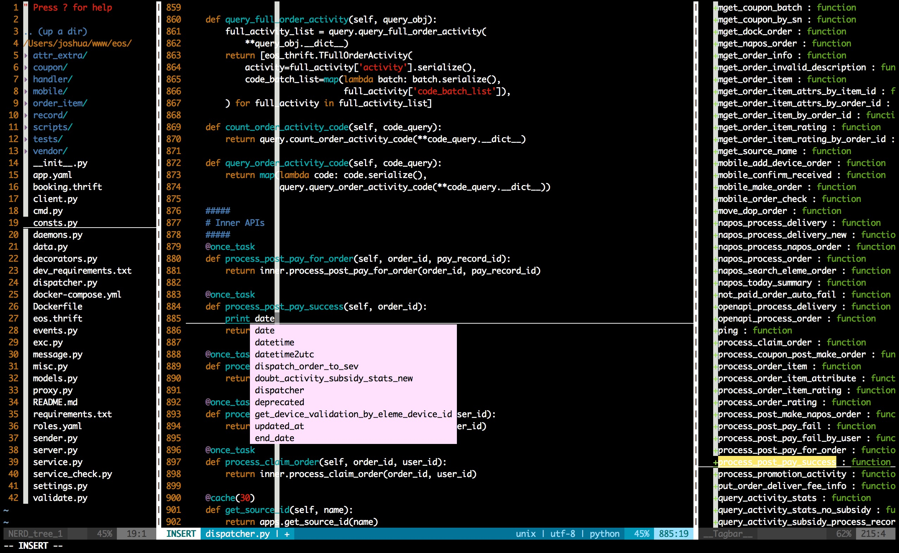

# my_vim

## 参考

此vim设置参考：[Vim改变生活，插件改变Vim](http://fancyseeker.com/?p=592)

----

## 快捷键

key|作用
----|-----
,g						    			|tagbar
,n						    			|nerdtree
w[hjkl]				    			|分屏切换
gt                          		|切换tab
(文件名上面)(v/Enter)					|在(新的/当前)分屏中打开文件
,q					    				|关闭对应分屏，退出不保存
,w						    			|关闭并保存
kj						    			|insert to normal
,cc						    			|注释
,cu						    			|取消注释
:vs						    			|纵向切屏
:sp						    			|横向切屏
,s						    			|语法错误信息
;/SHIFT+;				    			|nornal切换到命令行模式
H/SHIFT+右箭头 			    		|行首
L/SHIFT+左箭头			    			|行尾	
,p                         		|打开文件搜索栏
,jd                       		|跳转到变量定义处
F8                          		|按PEP8标准格式化文件
:Ag create_order --python   		|全局搜索"create_order"
'.                          		|移动光标到上一次的修改行
`.                          		|移动光标到上一次的修改点
CTRL+O									|go back
CTRL+I									|go forwards
control+y/g'Z               		|可跨文件跳转到上次修改位置(last_edit_maker提供功能)
:new/e/vs/sp/tabe filename  		|新建/当前tab/纵向/横向/新tab 打开 filename
CTRL+c & COMMAND+v          		|vim复制，主机粘贴
COMMAND+c & CTRL+v          		|主机复制，vim粘贴
,a                          		|insert模式下php文件autocomplete，由phpcomplete的<C-x><C-o> inoremap而来
,gs                         		|显示文件的git更改,类似于git diff命令的显示效果
:Gitv                       		|显示项目版本库的更改，类似于tig的效果
:Gblame                     		|在git项目中查看每行最后的更改情况
:Phpcs                      		|run code sniffer(代码规范检查, 要求太严格，推荐不用)
:Phpmd                      		|run mess detector (will ask for a rule XML file if not set，推荐不用)

## 注意

### vim安装YouCompleteMe插件

参考:http://www.oschina.net/question/2012764_237658

YouCompleteMe插件要求vim版本7.4

```
cd ~/.vim/bundle/YouCompleteMe
git submodule update --init --recursive
sh install.sh
```
OK!

运行install.sh的时候报错:`fatal error: '__debug'`

参考:http://stackoverflow.com/questions/29529455/missing-c-header-debug-after-updating-osx-command-line-tools-6-3

升级command lint tools到6.3.1

### 安装php code_sniffer

* 首先安装pear

```
sudo php /usr/lib/php/install-pear-nozlib.phar
sudo pear config-set php_ini /private/etc/php.ini
sudo pecl config-set php_ini /private/etc/php.ini
sudo pear upgrade-all
```

* 安装PHP_CodeSniffer

```
pear install PHP_CodeSniffer
```

* 运行`phpcs`，如果报错:

```
PHP Warning:  include_once(PHP/CodeSniffer/CLI.php): failed to open stream: No such file or directory in /usr/bin/phpcs on line 21
PHP Warning:  include_once(): Failed opening 'PHP/CodeSniffer/CLI.php' for inclusion (include_path='.:') in /usr/bin/phpcs on line 21
PHP Fatal error:  Class 'PHP_CodeSniffer_CLI' not found in /usr/bin/phpcs on line 24
```

则是由于/usr/lib/php/pear没有添加到php的`include_path`

* 修改`/etc/php.ini`,添加`include_path = "/usr/lib/php/pear"`，运行`phpcs -h`无误即可

* code_sniffer安装完毕

## OVERVIEW



可以参考:[http://www.cnblogs.com/junnyfeng/p/3633697.html](http://www.cnblogs.com/junnyfeng/p/3633697.html)

## colorscheme

### 主题搭配

    - vim-solarized + iterm-solarized
    - vim-blackbeauty + iterm-dracula

更改为`solarized`

- `git clone git://github.com/altercation/solarized.git`
- iterm2主题切换: 到 `solarized/iterm2-colors-solarized` 下双击 `Solarized Dark.itermcolors` 和 `Solarized Light.itermcolors` 两个文件就可以把配置文件导入到 iTerm 里
- vim主题切换: 
	- `cd vim-colors-solarized/colors`
	- `cp solarized.vim ~/.vim/colors/`
	- `vi ~/.vimrc`
	- `colorscheme solarized`
- ok
